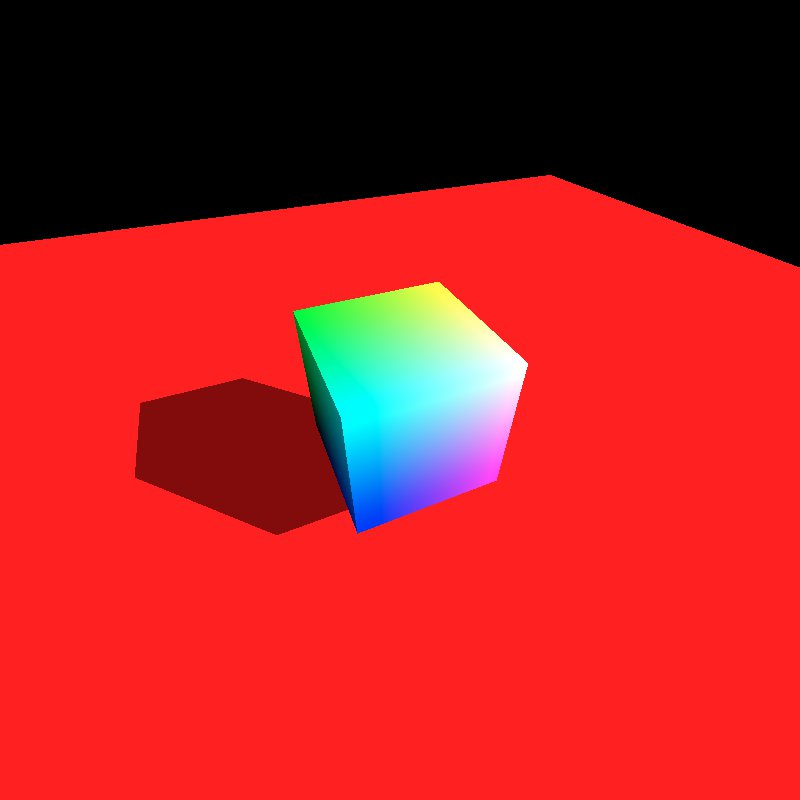

## Embree WASM build

This project uses CMake to build a WebIDL bound version of Embree4.
https://github.com/embree/embree
https://emscripten.org/docs/porting/connecting_cpp_and_javascript/WebIDL-Binder.html

I am not affiliated with Embree and have no position in this project. All code here is made as a personal project and has no guarantees. 

Due to the C-function nature of Embree, most functions in the rtcore_* are wrapped under a singular `RTC` object and accessed statically.

### Building
The build has been setup to use multiple IDL file fragments to compose a final IDL file. Custom builds may be made by modifying or conditionally including these files to include as much or little functionality as you want.

The IDL fragments containing rtcFunctions have the originating Header.H file note at the top. During the build process, these originating Header files will be accessed out of the Embree project and REGEX analyzed (warning, no guarantees on stability of this) to attempt to derive the method names and parameters. These files will write temporary headers, which will then be dynamically included into the singleton RTC object to form the JS-to-Singleton-to-Embree interface.

Additional methods are added to the Typing and Javascript using the *.extras files. Mainly these deal with memory alignment/management or wrapping/unwrapping of arrays.

#### Docker
There is a docker file that will build the project using the standard Emscripten docker image. This may be changed to alpine and a custom configuration in the future if it is smaller and trustworthy.

#### Non Docker
This project requires Emscripten and NodeJS to build. 
I personally use:
* EMSDK - https://emscripten.org/docs/tools_reference/emsdk.html 
* NVM - https://github.com/nvm-sh/nvm

EMSDK will require Python3 as well for the webidl_binder and core emscripten functionality.
NodeJS will be used to transform the IDL into header files, and for the NPX command used to produce the Typescript typing files (*.d.ts)

To build, run `sh build.sh`
The build will produce a `dist` folder containing:
* embree.d.ts - typescript typing
* embree.js - Emscripten loader module and WebIDL binding
* embree.wasm - Core WASM module - ~7.7MB in size, compressible to 1.5-2MB using zip compression if needed.

If compressing the library, most browsers should support using decompression-streams to stream a raw compressed stream directly into the streaming-compile of wasm, though most server hosting will allow transparent compression.

https://developer.mozilla.org/en-US/docs/Web/API/Compression_Streams_API
https://developer.mozilla.org/en-US/docs/WebAssembly/JavaScript_interface/instantiateStreaming_static

### Memory Warning
By default, the `tessellation_cach_size` for the project will cause Embree4 to by default attempt to allocate over 100MB of RAM. You can keep this as-is and enable a higher TOTAL_MEMORY, or when requesting a device send the config `tessellation_cache_size=0`.
When loading a larger model (Standford Bunny causes this issue), you will need a high Stack Size (already compiled as is) during the accelerated BVH construction to avoid running the stack out and crashing in the middle of a parallel-for with no error other than 'memory access'. The emscripten stack default was 64k, but the CMake existing build uses a 1MB stack, which alleviated my personal issues, but may be excess for what you require.

With my initial tests of one or two complex models, I did not need more than 6-8MB of RAM, and the default 16MB was more than enough. Most RAM I have needed was purely for storing RayCast results. This can be reduced in the WASM side by implementing tiling and copying off to a shared-array or other location, should you wish to not keep it controlled in the WASM layer.

Custom methods have been added for:
1. **TotalMemory/FreeMemory** - Derived from emscripten's heap tests. Utility usage for checking HEAP space
2. **Allocating RayHit(1|4|8)** - embree appears to not list these structs as being MemAlign in their headers, so custom methods were made to memalign allocate these to prevent assert failures during intersect. If marked as requiring alignment in the Embree header, the WebIDL binding would automatically align these.
3. **SizeOf RayHit** - to assist in direct memory access via Linear memory locations, or assist JS performing a memset to clear the memory of a RayHit between queries.
4. **Allocate RayMask** - this is simply a `int*` allocator, required for the mask-param in any multi-intersect (4/8/16) calls or associated point-query/occlude for the `valid` parameter. Named as `RayMask` in the WebIDL side for typing purposes.
5. **tileIntersect(1|4)** - demo routines added for personal testing purposes. They will render a tile of data in a single call, and save offset/stride segments of the RayHit item to a supplied buffer, such as just the Z channel of a Ray4 or just the across all 4-units worth of a Ng 12-byte channel for storing hit normals.
6. **alloc/wrap/copy Typed Array** - These methods deal with creation of typed arrays on the Heap. You can pass them to functions using the `typed_array_foo.byteOffset`value. This is understood by web IDL correctly as the pointer. These methods use the Typed Array's knowledge of their own element size during creation, so use element count, not byte size when referencing length
	1) **Wrap** - (pointer, N length, type) - will take a pointer (such as from C) and wrap it in a typed array of N length. The library has no knowledge of the actual when given an arbitrary poitner length, so it must be provided.
	2) **Alloc** ( N length, type) - will allocate an array of N items. (2, F32) will allocate 8 bytes. This will then call wrap using the N length.
	3) **Copy** ( array-like, type)- will take an existing array and type, then perform alloc, wrap, and set the contents of the array. 
7. **alloc/wrap/copy Aligned Type Array** This is the same as above, but uses memalign due to how many internal methods require specific alignment 

### Tutorial

Parts of the tutorial code are being ported over. As of now, it is not 1-to-1 in the Tutorial Application architecture, but the section is a work-in-progress.

Parts of the AffineSpace3f have been ported to the tutorial code, as have parts of the ISPCCamera

##### Triangle Geometry



*An unused vertex color array was in the tutorial, so a flag was added to the file to turn this off or on and switch from face to vertex coloring* 

##### Curve Geometry


*These were referred to as hairs in the code, but this is just curve rendering in the demo* 

### Usage
```typescript
import Embree from './em/embree'; 
// Hacks to make 'static' methods act as
// WebIDL Typescript generator expects
const RTC = (embree.RTC.prototype as typeof Embree.RTC);

function addGroundPlane(device: Embree.Device, scene: Embree.Scene) {
  const mesh = RTC.newGeometry(device, embree.RTC_GEOMETRY_TYPE_TRIANGLE);
  const vertices = RTC.setNewGeometryBuffer(
    mesh, embree.RTC_BUFFER_TYPE_VERTEX,
    0, embree.RTC_FORMAT_FLOAT3,
    4 * 4, 4);

  const f32_vert = new Float32Array(embree.HEAP8.buffer, vertices, 16);

  f32_vert.set([
  -10, -2, -10, 1,
  -10, -2,  10, 1,
   10, -2, -10, 1,
   10, -2,  10, 1]);

  const triangles = RTC.setNewGeometryBuffer(
    mesh, embree.RTC_BUFFER_TYPE_INDEX,
    0,embree.RTC_FORMAT_UINT3,
    3 * 4, 2);

  const u32_index = new Uint32Array(embree.HEAP8.buffer, triangles, 6);
  u32_index.set([ 0, 1, 2, 1, 3, 2]);

  RTC.commitGeometry(mesh);
  const geomID = RTC.attachGeometry(scene, mesh);
  RTC.releaseGeometry(mesh);
  return geomID;
}
const device = RTC.newDevice('verbose=3,threads=1,tessellation_cache_size=0');
addGroundPlane(device, scene);
RTC.commitScene(scene);

//raytrace here
```

For instanced geometry, Embree4 uses instanced-scenes, so that a committed scene can preserve it's BVH that has been built between instances. *Note: Normals returned by an instanced geometry will not be transformed back to initial ray-space, so you will need to test the instance you collided with and inverse the transform on the normal yourself.*


Demo code:
```typescript
const scene = RTC.newScene(device);
async function addRabbit(device: Embree.Device): Promise<Embree.Scene> {
  const rabbitData = await loadModel('bunny.obj');

  const vertexCount = rabbitData.vertices.length/4
  const indexCount = rabbitData.index.length/3;

  const mesh = RTC.newGeometry(device, embree.RTC_GEOMETRY_TYPE_TRIANGLE);
  const vertexBufferPtr = RTC.setNewGeometryBuffer(
    mesh, embree.RTC_BUFFER_TYPE_VERTEX,
    0, embree.RTC_FORMAT_FLOAT3,
    4*4, vertexCount);
  embree.HEAPF32.set(rabbitData.vertices, vertexBufferPtr/4);

  //Methods return raw pointer offsets into linear memory
  //Divide by 4 to convert from byte-offset to U32
  const indexBufferPtr = RTC.setNewGeometryBuffer(
    mesh,embree.RTC_BUFFER_TYPE_INDEX,
    0, embree.RTC_FORMAT_UINT3,
    3 * 4, indexCount);
  embree.HEAPU32.set(rabbitData.index, indexBufferPtr/4);

  RTC.commitGeometry(mesh);
  const scene = RTC.newScene(device);
  RTC.attachGeometry(scene, mesh);
  RTC.releaseGeometry(mesh);
  RTC.commitScene(scene);
  return scene;
}
```
The above could also be done using a SharedBuffer
```typescript
  const vertexCount = rabbitData.vertices.length/4
  const vertexBufferPtr = embree._malloc(rabbitData.vertices.length*4);
  const f32vertex = new Float32Array(embree.HEAP8.buffer, vertexBufferPtr, rabbitData.vertices.length);
  f32vertex.set(rabbitData.vertices);
  const vertexSharedBuffer = RTC.newSharedBuffer(device, vertexBufferPtr, rabbitData.vertices.length*4);

  RTC.setGeometryBuffer(
    mesh, embree.RTC_BUFFER_TYPE_VERTEX,
    0, embree.RTC_FORMAT_FLOAT3,
    vertexSharedBuffer,
    0, 4*4, vertexCount);
```

To instance the scene, you will need to first create the above scene (BLAS), then create a new Geometry of `RTC_GEOMETRY_TYPE_INSTANCE` and assign the rabbit scene to the Geometry via `setGeometryInstancedScene` , before you can use the geometry in the larger parent scene as an instance (TLAS).

```typescript
const INSTANCE_COUNT = 8;
const transformMatrix_ptr = embree._malloc(INSTANCE_COUNT * 4 * 16);
const transformMatrix = [];
for(let i = 0; i < INSTANCE_COUNT; i++) {
  transformMatrix[i] = new Float32Array(embree.HEAP8.buffer, transformMatrix_ptr + i*4 * 16, 16);
}

function createRabbitInstance(scene: Embree.Scene, rabbit: Embree.Scene, instance: number): Embree.Geometry {
  const g_instance0 = RTC.newGeometry(device, embree.RTC_GEOMETRY_TYPE_INSTANCE);
  RTC.setGeometryInstancedScene(g_instance0, rabbit);
  RTC.setGeometryTimeStepCount(g_instance0,1);
  RTC.attachGeometry(scene, g_instance0);
  RTC.releaseGeometry(g_instance0);
  RTC.setGeometryTransform(g_instance0,0,embree.RTC_FORMAT_FLOAT4X4_COLUMN_MAJOR, transformMatrix_ptr + instance * 4 * 16);
  RTC.commitGeometry(g_instance0);
  return g_instance0;
}

// create device, ground, and instance of rabbit

mat4.fromTranslation(transformMatrix[rabbitIndex], [0,.5,0])
mat4.fromRotationTranslation(transformMatrix[1], quat.setAxisAngle(quat.create(), [0,1,0], Math.PI/3), [1,0,.5])
mat4.fromRotationTranslation(transformMatrix[2], quat.setAxisAngle(quat.create(), [0,1,0], -Math.PI/3), [-1,0,-.5])
mat4.fromRotationTranslation(transformMatrix[3], quat.setAxisAngle(quat.create(), [0,1,0], -Math.PI/6), [-1.5,0.5,.5])
mat4.fromRotationTranslation(transformMatrix[4], quat.setAxisAngle(quat.create(), [0,1,0], Math.PI/6), [1.5,0.5,.5])
mat4.fromRotationTranslation(transformMatrix[5], quat.setAxisAngle(quat.create(), [0,1,0], -Math.PI), [.25,0,1.15])
mat4.fromRotationTranslation(transformMatrix[6], quat.setAxisAngle(quat.create(), [0,1,0], Math.PI/6), [-0.25,0.5,.5])
mat4.fromRotationTranslation(transformMatrix[7], quat.setAxisAngle(quat.create(), [0,1,0], Math.PI), [1.5,0.5,.5])

for(let i = 0; i < INSTANCE_COUNT; i++) {
  rabbits.push(createRabbitInstance(scene, rabbitScene, rabbitIndex++));
}

RTC.commitScene(scene);
```

The test project is currently under development to confirm functionality. It references the Stanford bunny (not included in the project).
https://en.wikipedia.org/wiki/Stanford_bunny
This is about a 70,000 triangle model.