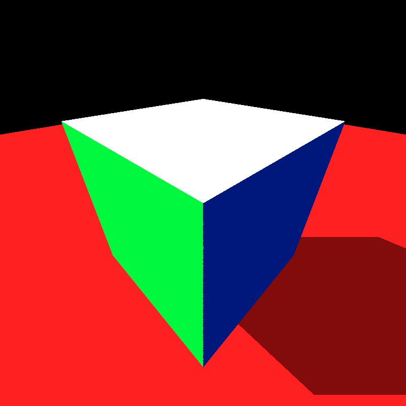
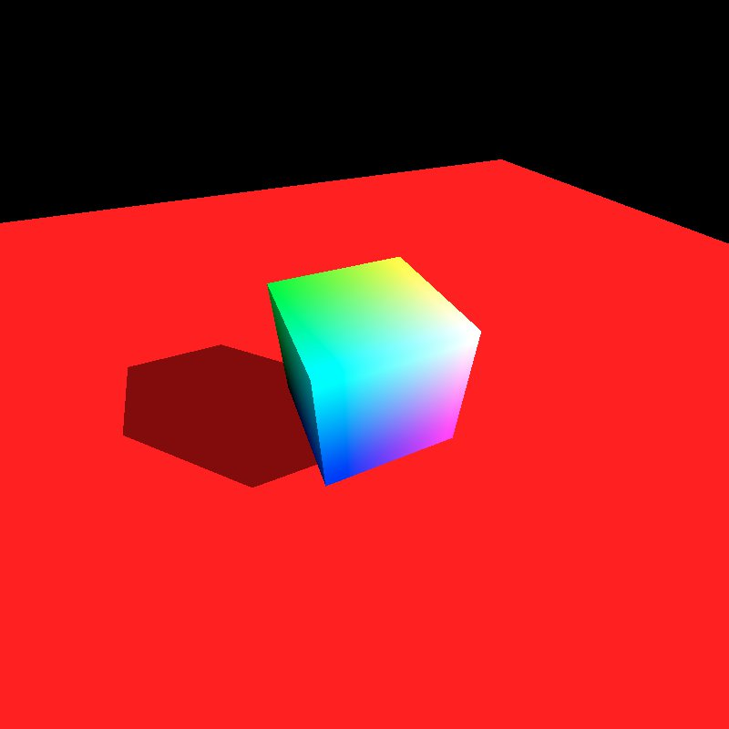
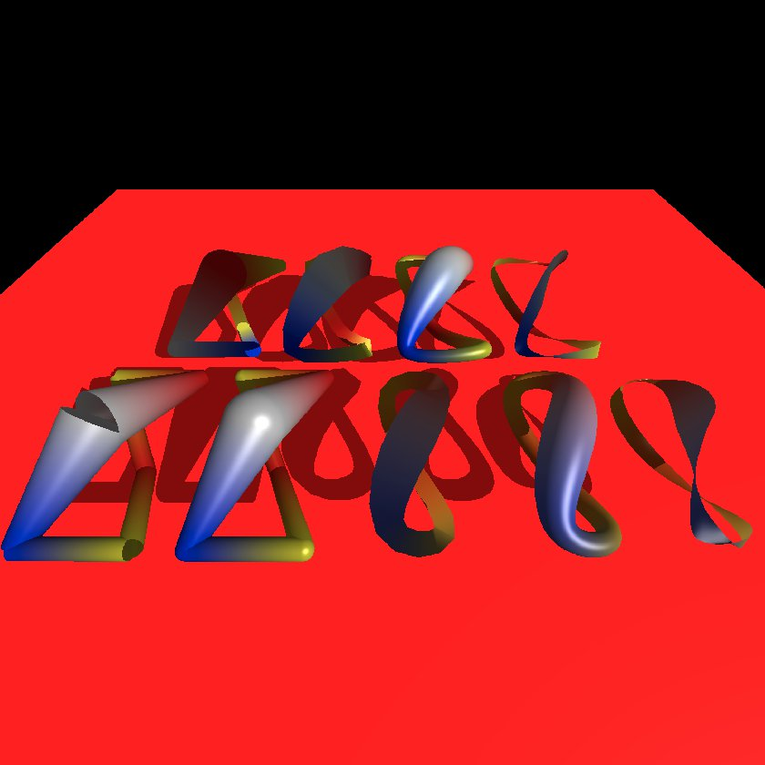
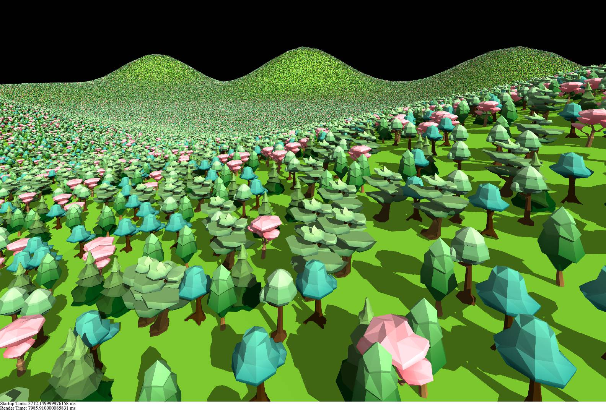
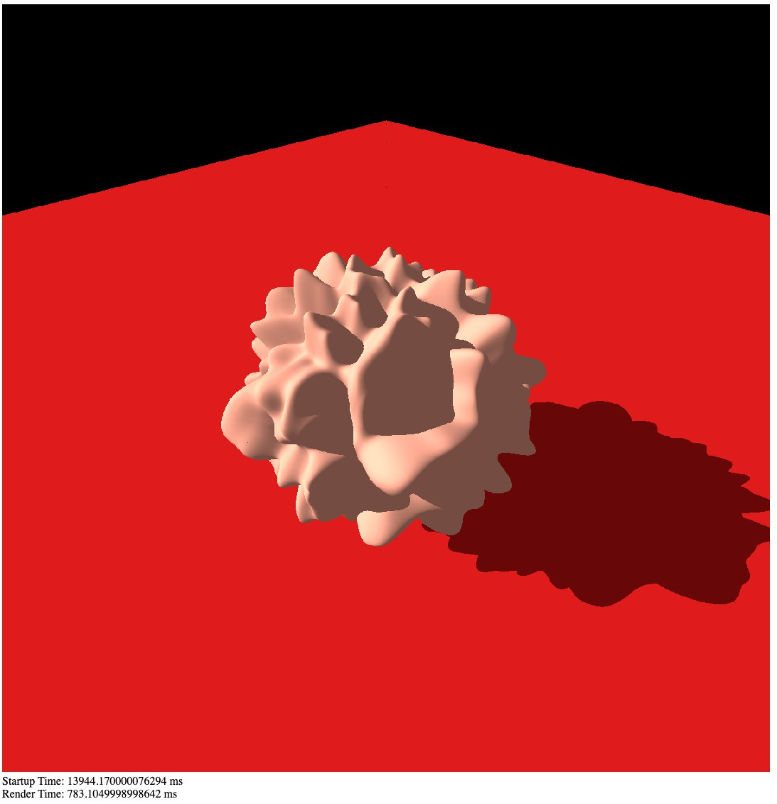
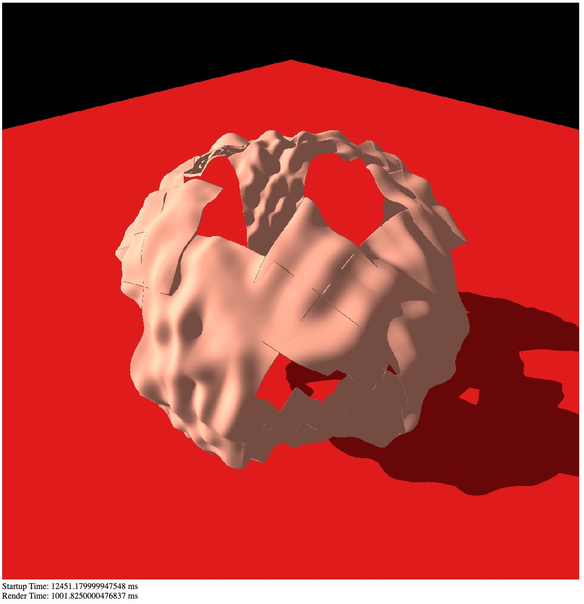

Parts of the tutorial code are being ported over. As of now, it is not 1-to-1 in the Tutorial Application architecture, but the section is a work-in-progress.

There are 4 rendering methods, flagged in the HTML file headers.
1. Standard - This ray-traces with 1-ray at a time in a single threaded nature
2. Standard - Multi-Threaded - This raytraces 1-ray at a time, but split into tiles in a multiple worker threads scatter/gather tile code
3. Stream - This uses the Embree3 technique of blocking a whole tile of rays into a single call at once in a WASM call, to avoid context-switching costs per ray
4. Stream - Multi-Threaded - This will combine 2 & 3, launching multiple threads and requesting tiles from each, which independently running a intersect1M stream API call.

Parts of the AffineSpace3f have been ported to the tutorial code, as have parts of the ISPCCamera

##### Triangle Geometry

*An unused vertex color array was in the tutorial, so a flag was added to the file to turn this off or on and switch from face to vertex coloring* 

##### Curve Geometry

*These were referred to as hairs in the code, but this is just curve rendering in the demo* 

#### Forest

Forest requires a heavy amount of memory.
32MB should work for Complexity 0 (250 tree squares)
Forest Complexity 1 requires about 48MB heap. Complexity 2 requires about 96MB heap.

#### Grid Geometry

Requires a mulit-threading enabled build along with a tesselation_cache of at least 1 and ~72MB of memory.
Multi-threading is not used for the BVH builder, but is needed for tesselation, since it will wait for a secondary thread to tesselate regardless of device configuration. This results in a lockkup on single-thread compiled libraries.

The Alternate render is a bug where I had the wrong displacement sampling UV values used. 
